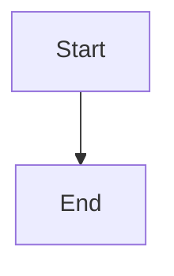

# Svelte Streamdown

A Svelte 5 markdown renderer for AI-powered streaming applications. Renders markdown as it arrives, token by token, with support for incomplete syntax, code highlighting, math, mermaid diagrams, and CJK text.

Port of [Vercel Streamdown](https://github.com/vercel/streamdown) for Svelte 5.

## Features

- **Streaming-optimized** — handles incomplete markdown gracefully via [remend](https://github.com/vercel/streamdown/tree/main/packages/remend)
- **Code highlighting** — Shiki-powered with dual-theme CSS variables (light + dark)
- **Code block header** — language label + copy-to-clipboard button
- **Mermaid diagrams** — opt-in, lazy-loaded on mount
- **Math** — LaTeX via KaTeX (opt-in)
- **CJK support** — correct punctuation handling for Chinese/Japanese/Korean
- **GitHub Flavored Markdown** — tables, task lists, strikethrough
- **Security** — rehype-harden sanitization
- **Incremental rendering** — only changed blocks re-process through the pipeline
- **Animations** — fade, blur, slide-up, slide-down

## Install

```bash
npm install github:undivisible/svelte-streamdown
```

Or with other package managers:

```bash
bun add github:undivisible/svelte-streamdown
pnpm add github:undivisible/svelte-streamdown
yarn add github:undivisible/svelte-streamdown
```

Requires Svelte 5.

## Usage

```svelte
<script>
  import { Streamdown } from "svelte-streamdown";
  import "svelte-streamdown/styles.css";

  let markdown = $state("**Hello** world");
</script>

<Streamdown {markdown} />
```

## Props

| Prop                       | Type                       | Default       | Description                                                           |
| -------------------------- | -------------------------- | ------------- | --------------------------------------------------------------------- |
| `markdown`                 | `string`                   | `""`          | Markdown content to render                                            |
| `mode`                     | `"streaming" \| "static"`  | `"streaming"` | Streaming mode repairs incomplete syntax; static renders as-is        |
| `dir`                      | `"auto" \| "ltr" \| "rtl"` | `"auto"`      | Text direction. `auto` detects per-block                              |
| `animated`                 | `boolean \| string`        | `false`       | Animation type: `true` (fade), `"blur"`, `"slide-up"`, `"slide-down"` |
| `caret`                    | `boolean \| string`        | `false`       | Show a caret at the end (`"block"`, `"circle"`, or custom char)       |
| `parseIncompleteMarkdown`  | `boolean`                  | `true`        | Enable incomplete markdown repair (streaming mode)                    |
| `normalizeHtmlIndentation` | `boolean`                  | `false`       | Remove extra indentation from HTML blocks                             |
| `rehypePlugins`            | `PluggableList`            | `[]`          | Additional rehype plugins                                             |
| `remarkPlugins`            | `PluggableList`            | `[]`          | Additional remark plugins                                             |

## Code Highlighting

Code blocks are highlighted with [Shiki](https://shiki.style/) using dual-theme CSS variables. Both light and dark themes are baked into the HTML — your CSS switches between them.

Code blocks include a **header bar** with:

- Language label (e.g. "typescript")
- Copy-to-clipboard button

Languages are loaded on demand — only the ones used in your content are fetched.

### Theming

Shiki sets CSS custom properties on `<pre>` and token spans:

| Property           | Light              | Dark              |
| ------------------ | ------------------ | ----------------- |
| `<pre>` background | `--shiki-light-bg` | `--shiki-dark-bg` |
| `<pre>` foreground | `--shiki-light-fg` | `--shiki-dark-fg` |
| Token color        | `--shiki-light`    | `--shiki-dark`    |

Theme switching is automatic via `prefers-color-scheme` and `.dark` class:

```css
/* Default: light mode */
.svelte-streamdown pre:has(code.shiki) {
  background-color: var(--shiki-light-bg);
  color: var(--shiki-light-fg);
}
.svelte-streamdown .shiki .line span {
  color: var(--shiki-light);
}

/* System dark mode */
@media (prefers-color-scheme: dark) {
  .svelte-streamdown pre:has(code.shiki) {
    background-color: var(--shiki-dark-bg);
    color: var(--shiki-dark-fg);
  }
  .svelte-streamdown .shiki .line span {
    color: var(--shiki-dark);
  }
}

/* Manual .dark class */
.dark .svelte-streamdown pre:has(code.shiki) {
  background-color: var(--shiki-dark-bg);
}
.dark .svelte-streamdown .shiki .line span {
  color: var(--shiki-dark);
}
```

Override by targeting `.svelte-streamdown` in your own CSS.

## Math

Math rendering via KaTeX. Add remark-math and rehype-katex:

```svelte
<script>
  import remarkMath from "remark-math";
  import rehypeKatex from "rehype-katex";
  import "katex/dist/katex.min.css";
</script>

<Streamdown
  {markdown}
  remarkPlugins={[remarkMath]}
  rehypePlugins={[rehypeKatex]}
/>
```

## Mermaid Diagrams

Mermaid is opt-in. Install mermaid, then use fenced code blocks with `mermaid` language:

````markdown

````

Mermaid lazy-loads on mount and renders as SVG. Falls back to preformatted text on error.

```bash
npm install mermaid
```

## Animations

Pass `animated` as a string to select animation type:

```svelte
<Streamdown {markdown} animated="blur" />
<Streamdown {markdown} animated="slide-up" />
<Streamdown {markdown} animated="slide-down" />
```

Or use the boolean shorthand for fade-in:

```svelte
<Streamdown {markdown} animated />
```

## Custom Plugins

Pass any unified remark/rehype plugins:

```svelte
<Streamdown
  {markdown}
  remarkPlugins={[remarkMath, myRemarkPlugin]}
  rehypePlugins={[rehypeKatex, myRehypePlugin]}
/>
```

## Styling

The library is CSS-framework-agnostic. Import the default stylesheet:

```js
import "svelte-streamdown/styles.css";
```

Works with plain CSS, Tailwind, UnoCSS, or any other framework. Override by targeting `.svelte-streamdown`:

```css
.svelte-streamdown pre {
  background: #1e1e2e;
  border-radius: 8px;
}
```

## Packages

| Package                      | Description                                         |
| ---------------------------- | --------------------------------------------------- |
| `packages/svelte-streamdown` | Svelte component (npm: `svelte-streamdown`)         |
| `packages/remend`            | Incomplete markdown repair (retained from upstream) |

## Development

```sh
bun install
bun run format:check   # Prettier
bun run typecheck       # svelte-check
bun run lint            # Ultracite (Biome)
bun run test            # Vitest
bun run build           # Build all packages
```

## Differences from upstream

This is a Svelte port of [Vercel Streamdown](https://github.com/vercel/streamdown) (React).

### vs Vercel Streamdown (React)

| Feature           | upstream (React)                            | this (Svelte)                         |
| ----------------- | ------------------------------------------- | ------------------------------------- |
| Framework         | React 18+                                   | Svelte 5                              |
| Lexing            | Custom remark pipeline                      | Same unified/remark pipeline          |
| Code highlighting | Component-level plugin (`@streamdown/code`) | rehype plugin (inline in pipeline)    |
| Math              | Opt-in (`@streamdown/math`)                 | Opt-in via remark-math + rehype-katex |
| Mermaid           | Opt-in (`@streamdown/mermaid`)              | Opt-in (lazy-loaded)                  |
| Animations        | Blur, fade, slide                           | Fade, blur, slide                     |
| Code block header | Copy, download, language                    | Copy, language                        |
| Theme system      | Tailwind + shadcn                           | Plain CSS (user stylesheets)          |
| Streaming repair  | remend                                      | remend (same library)                 |

### vs beynar/svelte-streamdown

| Feature           | beynar (Svelte)                    | this (Svelte)                             |
| ----------------- | ---------------------------------- | ----------------------------------------- |
| Lexing engine     | `marked` (custom lexer)            | `unified`/remark (standard pipeline)      |
| Code highlighting | Component-level (shiki/core)       | rehype plugin (inline in pipeline)        |
| Theme system      | Tailwind + shadcn + clsx           | Plain CSS (framework-agnostic)            |
| Component model   | Element + Svelte snippets          | HastNode (recursive hast→Svelte)          |
| Mermaid           | Opt-in component import            | Opt-in (auto-detect ` ```mermaid `)       |
| Math              | Opt-in component import            | Opt-in via remark-math + rehype-katex     |
| Animations        | Blur, fade, slide (configurable)   | Fade, blur, slide (CSS data-attribute)    |
| Code block        | Copy + download + language         | Copy + language                           |
| Security          | None built-in                      | rehype-harden sanitization                |
| Streaming repair  | remend                             | remend (same library)                     |
| CSS approach      | Tailwind utility classes           | CSS custom properties + `prefers-color`   |
| Dual-theme        | Inline `color` per token           | CSS vars (`--shiki-light`/`--shiki-dark`) |
| Package weight    | Heavy (tailwind + mermaid + katex) | Lean (mermaid/katex optional)             |
| License           | MIT                                | MPL-2.0                                   |

## License

MPL-2.0. Upstream code from Vercel Streamdown retains Apache-2.0 license.
