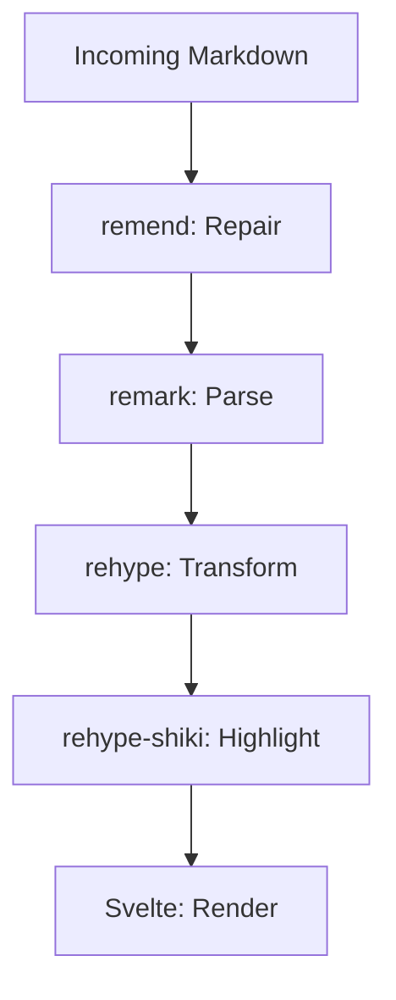

# Hello World

This is **Streamdown** — a Svelte port of Vercel's streaming markdown renderer.

## Features

- Streams in real-time
- Repairs incomplete syntax
- Code blocks, math, tables

```ts
const greeting = "Hello from Streamdown";
```

Math: $E = mc^2$

---

## How it works

Streamdown processes markdown as it arrives, token by token. The `remend` library repairs incomplete syntax before rendering.

```svelte
<script>
  import { Streamdown } from "svelte-streamdown";
  import "svelte-streamdown/styles.css";

  let markdown = $state("");
</script>

<Streamdown {markdown} />
```

### Rendering pipeline

1. **Parse** incoming text into blocks
2. **Repair** incomplete markdown with remend
3. **Transform** through remark → rehype
4. **Sanitize** output for safety
5. **Render** as Svelte components



> No flickering. No broken layouts. Just smooth streaming.

---

## Comparison

| Feature | this | beynar | vercel |
|---------|------|--------|--------|
| Framework | Svelte 5 | Svelte 5 | React 18+ |
| Lexing | unified/remark | marked | unified/remark |
| Code highlighting | rehype plugin | component-level | plugin |
| Mermaid | auto-detect | component import | plugin |
| Math | remark-math | component import | plugin |
| CSS | framework-agnostic | Tailwind | Tailwind |
| Security | rehype-harden | none | rehype-harden |
| License | MPL-2.0 | MIT | Apache-2.0 |

Install: `npm install github:undivisible/svelte-streamdown`

---

*Port of [Vercel Streamdown](https://github.com/vercel/streamdown) for Svelte 5.*
